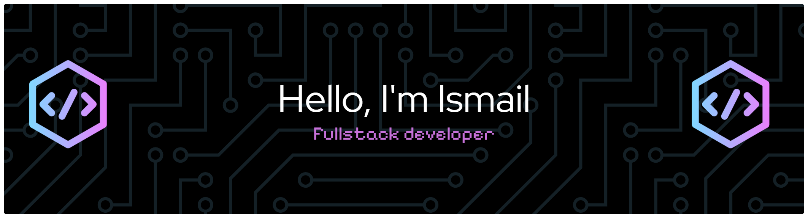

###

###

  
  
  
  
  
  
  
  
  
  
  
  
  
  
  

###

  
  
  
  

###

  <!--  -->
  

###

 

###

<picture data-importer="pacman">
  <source media="(prefers-color-scheme: dark)" srcset="https://raw.githubusercontent.com/ismailwasil/ismailwasil/pacman-output/pacman-contribution-graph-dark.svg?game=pacman">
  <source media="(prefers-color-scheme: light)" srcset="https://raw.githubusercontent.com/ismailwasil/ismailwasil/pacman-output/pacman-contribution-graph.svg?game=pacman">
  
</picture>

###
